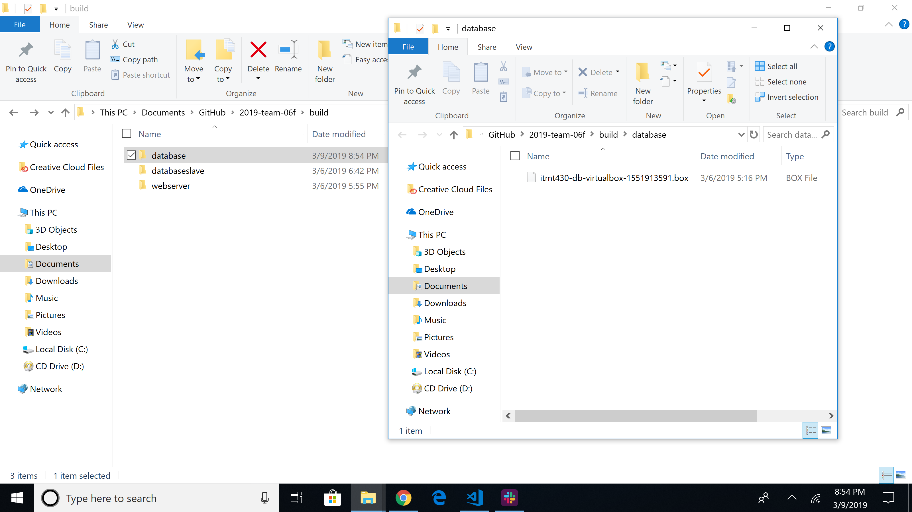
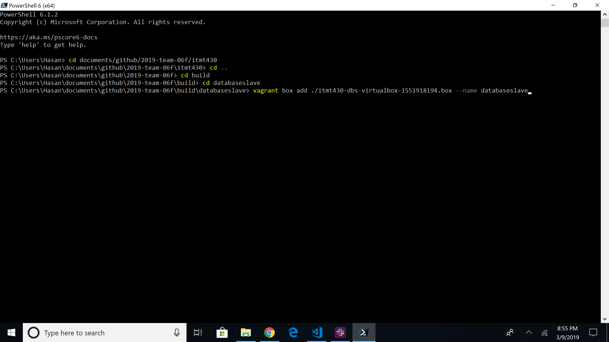
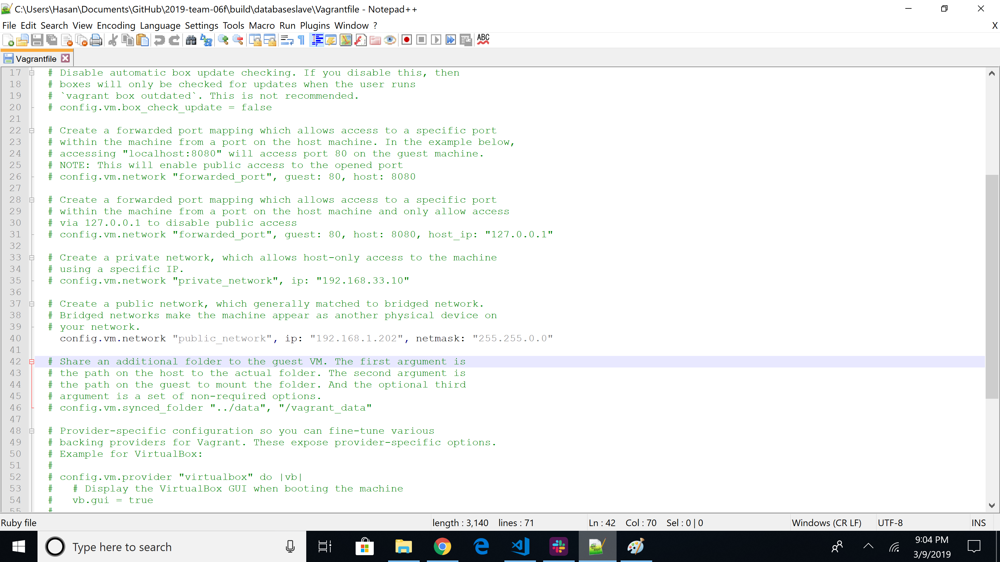

# Pre-steps to take
In order for the host system to send environment variables to the guest Vm being built you have to explicitly declare them on the command line before you issue a ```packer build``` command.

This is how we are passing passwords/RSA keys securely.

[https://www.packer.io/docs/templates/user-variables.html](https://www.packer.io/docs/templates/user-variables.html)

### What we need to set username and passwords securely in Packer
1) Issue the command inside of the code/itmt430 folder, ```cp variables-sample.json variables.json```
    1) The ```variables.json``` file contains key value pairs of variables and passwords to be passed into the provisioner shell script.
    1) This renames the file ```variables-sample.json``` to ```variables.json```  (there is an entry in the .gitignore so you cannot accidentally git push your passwords).
1) Edit the ```variables.json``` file replacing default values with your own    
1) Issue the commands inside of the code/itmt430 folder ```packer build --var-file=./variables.json ubuntu16045-itmt430-database.json``` and ```packer build --var-file=./variables.json ubuntu16045-itmt430-webserver.json``` and ```packer build --var-file=./variables.json ubuntu16045-itmt430-database-slave.json``` and ```packer build --var-file=./variables.json ubuntu16045-itmt430-cache.json``` to begin the install with password, usernames, and RSA private key properly seeded
    1) This way we can securely build the system, deploy it and when building it pass in passwords via environment variables
1) Once all four servers are built, go the the build folder and create a seperate folder for each box file and move each one into it's specific folder. 

1) Issue the commands ```vagrant box add ./itmt430-db-virtualbox-1551913591.box --name database``` and ```vagrant box add ./itmt430-ws-virtualbox-1551917192.box --name webserver``` and ```vagrant box add ./itmt430-dbs-virtualbox-1551918194.box --name databaseslave``` and ```vagrant box add ./itmt430-c-virtualbox-1551918198.box --name cache``` inside the appropriate folders to add the boxes making sure to replace the box numbers with your box numbers.

1) Issue the commands ```vagrant init database``` and ```vagrant init webserver``` and ```vagrant init databaseslave``` and ```vagrant init cache``` inside the appropriate folders.  
1) Configure the Vagrantfiles for each server by uncommenting line 40 and replacing it with ```config.vm.network "public_network", ip: "127.0.0.1", netmask: "255.255.0.0"```. Replace the 127.0.0.1 with the ip used for that specific server in the variables.json when building with Packer. Save the Vagrantfiles.

1) Issue the command ```vagrant up``` for each of the servers.
1) To access TruHawk, enter the webserver IP into your web browser. 
