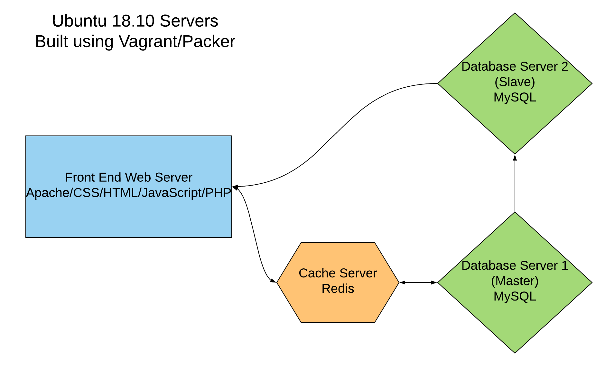

# Sprint 1 Report
## Team True
## Project: Flickr/Instagram Hybrid Internal Photo Search Site
## Site Name: TruHawk

### Roles
1. Project Manager -- Hasan Rizwan
2. Developer -- Daniel Kolov
3. Jr Developer -- Shan Shazad
4. IT Operations -- Bhumika Patel / Jason D’Souza
5. UI/UX Developer -- Sarina Stoker
#### Project Goals
- Choose Roles (C)
- Choose Project (C)
- Install Required Software (C)
- Get Acclimated Using Git (C)
- Get Acquainted Using Communication and Management Platforms (C)
- Decide on Language(s)/Framework(s) (C)
- Operating System Platform (C)
- Data Storage Technology (C)
- Start a home site design (C)
- Setting up our servers through Vagrant / Packer (I) 
- Interface Design (I)
#### Project Accomplishments: 9/11 Goals Accomplished

1. Language and Framework of Choice
a. HTML, CSS, Javascript
b. PHP
c. MySQL
d. Vagrant/Packer
e. Redis
2. Operating System
a. Linux - Ubuntu 18.10
3. Plan for Data Storage and Use of Master & Slave
a. 2 Database Servers running MySQL
b. 1 server will serve as a master server and 1 server will be a slave
4. Data Encryption
a. According to whatever database field we create, it will be encrypted using a symmetric cipher provided by OpenSSL. Password fields will be encrypted data using a one-way password hash.
b. We will continue to work on data encryption once we have a fully working functioning UI. 
5. Responsive Design
a. Website design will include mobile queries for resizing
6. Use of https
7. Use of User Authentication
a. Authenticated- Login with myIIT credentials
b. Unauthenticated- restricted features
8. Creation of Dev Environment (Upcoming)
9. Layout Design & Management of Visio (Upcoming)
10. Management of Project Progress
a. Use of Slack and Trello
b. Updates are deployed to Github
11. 15 Real Test Users (I)

