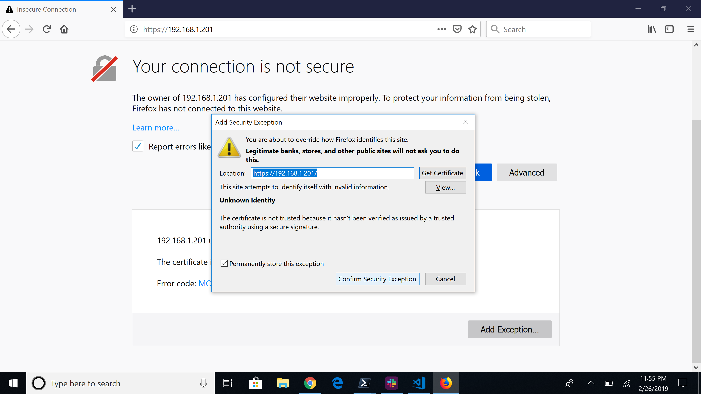
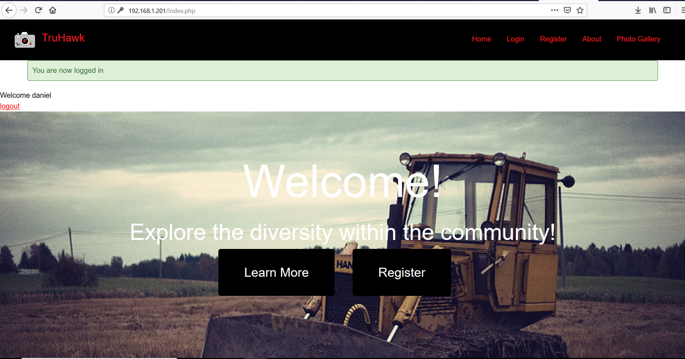
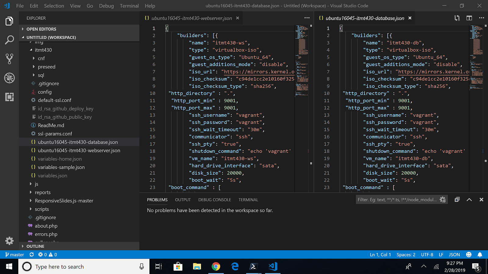
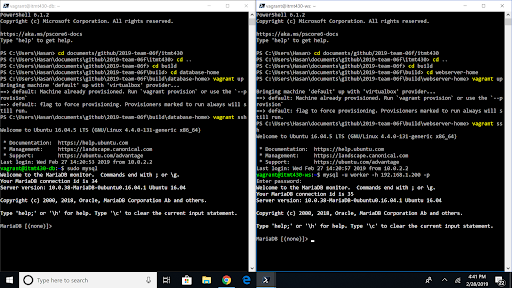
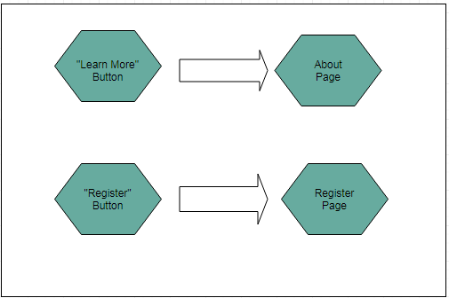
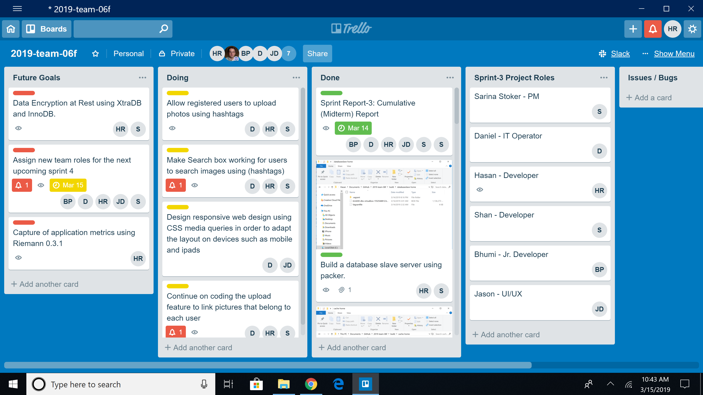
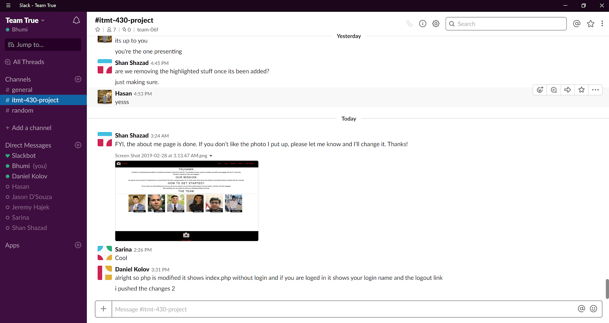
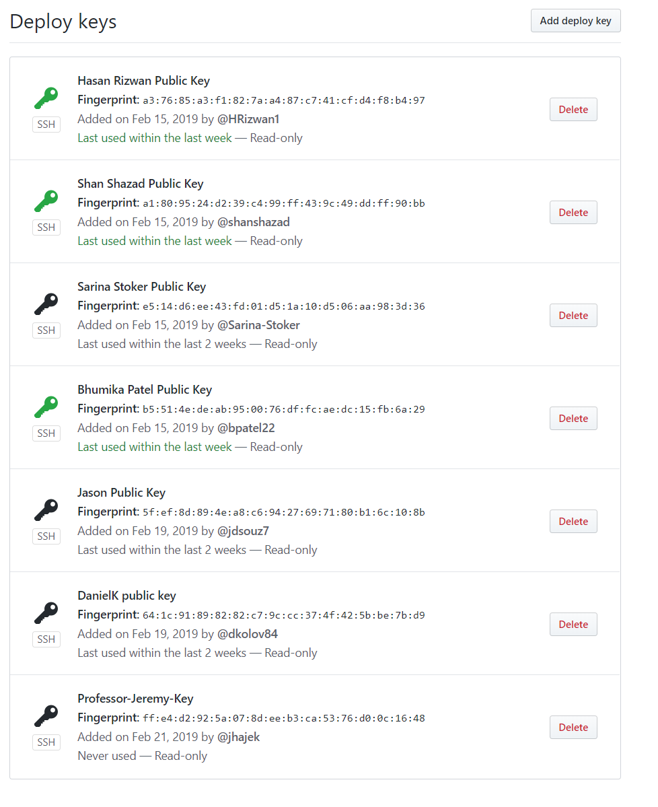

# Sprint 3 Report
## Team True
## Project: Flickr/Instagram Hybrid Internal Photo Search Site
## Site Name: TruHawk
### Roles
1. Project Manager -- Sarina Stoker
2. Developer -- Shan Shazad / Hasan Rizwan
3. Jr Developer -- Bhumi Patel
4. IT Operations -- Daniel Kolov
5. UI/UX Developer -- Jason D'Souza

### Project Goals:

 * To build a slave database server using vagrant and packerbuild (C)
 * To build Redis cache server (C)
 * Fix binding error (50 -server.cnf is ignored causing a binding error due to permissions) (C)
 * Designed and create tables for users and pictures using mysql (C)
 * Create “create-new.sql” and “insert-new.sql” files to use at build for automation (C)
 * Create an upload button for a registered user to upload and view all pictures (C)
 * Create a search box for users to search for photos (IP)
 * Create admin panel to view all users and to create admins / regular users (C)
 * Restricted privileges for unregistered : read access (index page) (C)
 * Further develop the user panel by allowing users to upload photos (C)
 * Layout diagram for user/admin interface  (IN)
 * Hashtag the photos (IN)
 * To establish connection from web server to database server (C)
 * Gather pictures we will use for test user accounts and store in our database (C)
 * Be able to display photos from database in user accounts (C)
 * Data Encryption at Rest using XtraDB and InnoDB (I) 
 * To make the website responsive in order to fit any form factor, such as desktop, mobile, and tablet (IP)

### Project Accomplishments: Goals Accomplished (14/17)

 * Built a slave database server using vagrant and packerbuild
 * Built Redis cache server
 * Automated of Data Entry
 * Designed & Created tables for users and pictures using MySQL
 * Created “create-new.sql” and “insert-new.sql” files to use at build for automation
 * Admin Panel created
 * User Panel created
 * Created search box and upload feature-button
 * Gathered test photos for each test user and stored in the database (225 photos)
 * Website pulls from the database to display photos in user accounts
 * Users can upload as well as view all available photos
 * Binding error fixed from one of our github issues last sprint
 * Established connection from web server to database server 
 * Restricted privileges for unregistered users

### Project Requirements:
1. Language and Framework of Choice:

  * HTML-5 is used to structure the webpages
  * CSS-3 is used to style our web pages 
  * Javascript / jQuery is used for the photo slideshow on the gallery page
  * PHP is used for login and registering process
  * Vagrant is primarily used as a development enironment tool
  * Apache 2.4.18 (Ubuntu) web server hosts HTML, PHP, Javascript, and CSS
  * Redis 5.0.3 is used as in-memory data structure store and allow for faster searching and to cache data from the webserver
  * MariaDB Server 10.0.38 provides an SQL interface for accessing data
  
2. Operating System Platform:

    a. Linux - Ubuntu 16.04.5

    b. Process of secrets management: gitignore, openSSL, SSH key

        i. Gitignore - The gitignore file was created for the purpose of preventing files from being uploaded without needing to explicitly exclude them. Any file added to gitignore is not included in git commits. Using gitignore allows system-specific files to be untouched, and it ensures that those sensitive files will never get uploaded.

        ii. openSSL - Purpose of using openSSL is to keep the sending and receiving traffic safe and secure between the server and clients without the possibility of the messages being intercepted by outside parties.

        iii.  SSH Key - To automate the secure access to the servers, bypassing the need to manually enter log-in credentials. The SSH key provides strong, encrypted verification and communication between the user and a remote computer.

        iv. SHA1-hash - We used SHA-1 to hash our passwords

        v. Priveleges - Unregistered users cannot view photos; Admin have the ability to view and create new users

    c. Capture of application metrics: 

        We do not have a schema for application metrics at this time.

  
3. Use of Data Store:

  * We are using 2 database servers (Platform: MySQL/MariaDB)
  * One of the database server serves as the master which we write to. One of the uses of this database is to store the photos which we upload for testing, as well as photos uploaded by users. Secondly,  this server hosts the user information such as names, emails, usernames & passwords.
  * The other database server serves as the slave and is the database which we read from. User infomration for logging in as well as photos are being pulled from this database for use in our website.
  * One Redis Cache Server used for caching the data that a webserver serves. Redis is a NoSQL key-value data store. For storing a value, we associate it with a key and store it in Redis. Purpose of using Redis caching is to improve database loading performance.

4. Data Encryption at Rest:

  * Encrypted using a symmetric cipher provided by OpenSSL. Password fields are encrypted using SHA1-hash with salt (salt concatenates random data with the hash)
  * MariaDB 10.0.38 has Data at Rest Encryption and is fully supported for XtraDB and InnoDB. 
  
  XtraDB: A storage engine for the MariaDB 
  
  InnoDB: A storage engine for the database management system MySQL. 
  
  * MariaDB allow our files to encrypt:
     - All tablespaces
     - Individual tables
     - Uses a 32-bit integer as a key identifier.
     - Encryption keys can also be rotated which basically creates a new version of the encryption key. Decryption is also readable through Maria’s file server keys. 

5. Use of MySQL/MariaDB Database Master-Slave Replication:

  * 2-Database Servers running MySQL/MariaDB - 1 server serves as a master server and another server servers as a slave. Master and slave servers are connected.
  * The purpose of using the master-slave replication process is to enable data from one MySQL database server (servering as 'the master') to be copied automatically to the another MySQL databse server (which serves as 'the slave'). 
  * The master-slave replication is a one-way replication (from master to slave), the master database is used only for the write operations, while the slave database is only used for read operations.
  * During designing or deploying application, all the write operations (statement/query that changes the state of database) are excuted ONLY on the master server. As to minimize the risk of data conflicts on the slave, changes can only be made through the replication process 
 * 1 Apache web server hosts HTML, PHP, JavaScript and CSS
 * 1 Redis Cache server

(Our setup uses the Apache server for providing the UI (our website) to the end user, information from registration page and users uploading photos are written to the master database server. The master is connected to a slave server which holds a copy of the database used for reads. Writes and reads are seperated to minimize the required movement of the disk head.  On the master database, separating write from read frees up resources to focus on writes only and minimize the movement of the head by writing a few queries in a sequence and only moving the head once every few writes to move the data into the “heap” (permanent storage in the database). On the slave database, reducing its functions to primarily reads which then allow it to handle more queries by freeing resources for the job.

A Redis Cache server is placed between our Web server and Slave Database server and is be responsible for storing a portion of the database entries and allow for faster searching and queries entered on the web server.)

 
6. Responsive Design (In-progress):

 Our responsive design is in-progress but is not an attained goal at this time.

Our goal is to have our website responsive that adapts the layout to the viewing environment by using CSS media queries (an extension of the @media rule).

“Why media queries?” - Media queries allow the page to use different CSS style rules based on characteristics of the device the site is being displayed on, most commonly the width of the browser.

Technically we want a media-rich, widescreen page for desktop viewing and a smaller size page formatted for small screen viewing, with less clutter, larger fonts and tighter-wrapping constraints for mobile viewing.

 "Why don't we have this yet?" - Because we are focusing on the functional elements of our site for use on a web browser first.

7. Use of HTTPS:

The entire website has left HTTP behind and switched to HTTPS. The “S” in HTTPS stands for “Secure”. It’s the secure version of the standard “hypertext transfer protocol” your web browser uses when communicating with websites. It is important for our application to run on HTTPS to gain the trust of our users. We have generated a self-signed certificate. The certificate is issued by Team True at the Illinois Institute of Technology and is good for one year.

    

  * Firewall
    - Using UFW (Uncomplicated Firewall) in Apache 2:
    - Ideally, we want to limit the number of ports open and only want to use which we need. This is a list of open ports and our current firewall setup.
   
 

  * Authentication keys (if applicable) 
  * Seeding of usernames and passwords 
  * Pre-seeding databases/datastores with schema and records ----//
  
8. Use of User Authentication:

**Unauthenticated users access:** 

* Have access to “read-only” data
* Restricted features until account created (cannot view gallery or have any access to photos without an account)
**Authenticated normal users have access to:**
  * Upload photos
  * View own photos
  * Search for photos (hashtags)
  
**Administrator Access:**
  * Custom made admin panel 
  * Able to delete other users photos
  * Able to delete accounts
  * Able to create accounts
9. Creation of Dev Environment:

 We have created the webserver, database master and slave, as well as the cache server using packer. All of our servers are currently deployable. 

10. Layout Design:
  * Home page:
  

  * Button Link:
  

  * Login & Register page:
  

  * Photo-Gallery page:
  

  * Site Flow:
  
  

11. Management of Visio Diagram:

Diagrams managed on a weekly basis or whenever we have an update by UI/UX and Project Manager. A tool that we are using to create diagrams is LucidChart.

12. Management of project progress:

Mostly all the communication and update process for this project is done through slack. We are keeping track of our to-do, in-progress and done tasks through trello. Upon the completion of the task, the person assigned to that task moves the card to the done section. We are keeping in contact throughout the duration of the sprint via slack to update eachother on accomplishments/issues.

  * Trello:
  

  * Slack:

  * Github:
  
  
  
13. Test Users:

Fifteen test users were generated, and the data is currently being used in our MariaDB database at build. New users can be added or deleted from the database thereafter. For the purpose, ‘.sql’ files are being used with the insert command to add values into the username, password and other account required fields.

**Any issues/Bugs?**

We had an issue with our web server not working in the lab. It might be just a matter of restarting the system we were tasting on and we will attempt it again at our next meeting in the smart lab.

We also had an issue where mariadb was not granting permissions to the user "worker" and it turned out after countless hours of hair pulling that it was missing '' surrounding the IP address.

**Goals for Next Sprint:**
  * Responsive design, making the website function properly in other form factors:mobile & tablet.
    - Include mobile first css which will detect screen size and style our webpage according to device it's been used on.
    - Add JQueries that will assure a great user experience on any screen size.
  * Data Encryption at Rest using XtraDB and InnoDB
  * Functioning search box

#### Individual Reflections
**Daniel** - 

**Sarina** - 

**Jason** - 

**Shan** -  

**Hasan** -   

**Bhumi** - 
