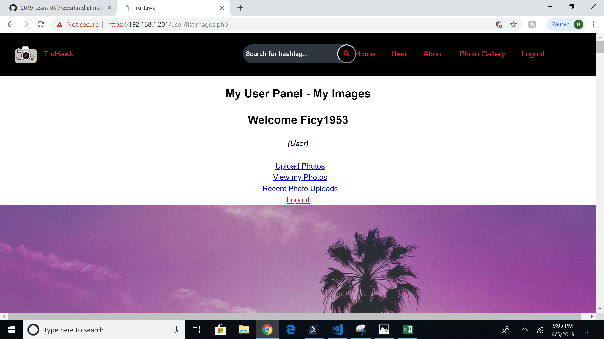
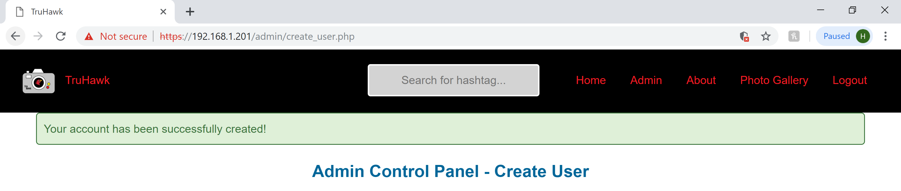
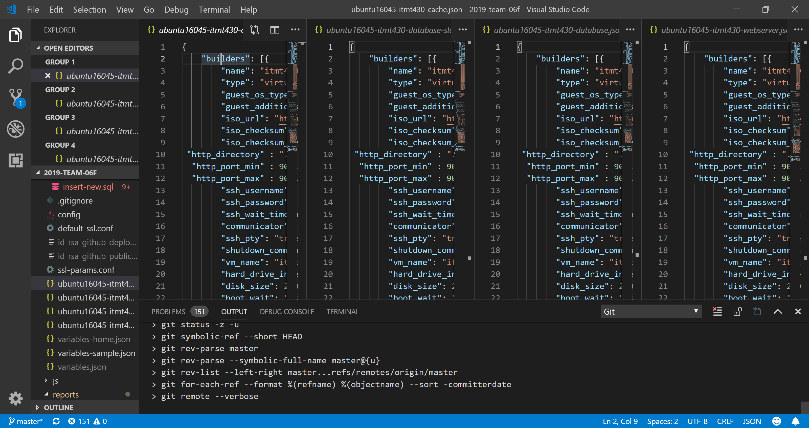
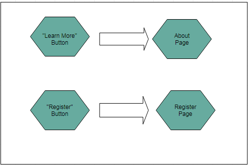
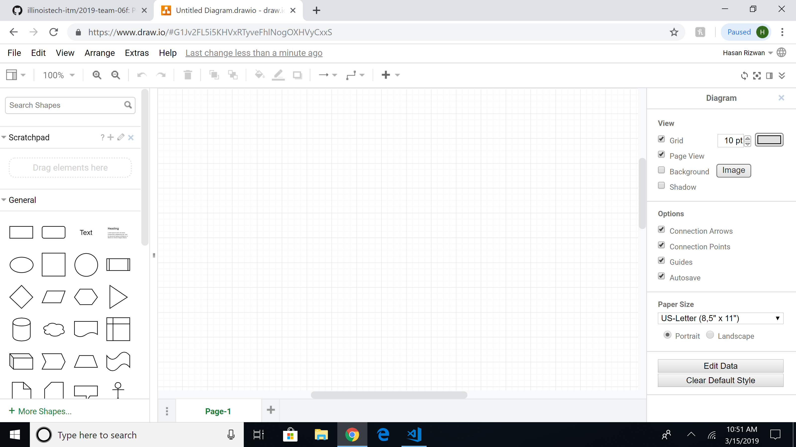
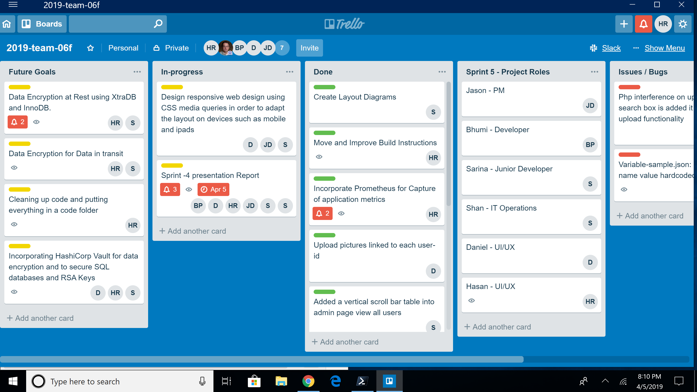
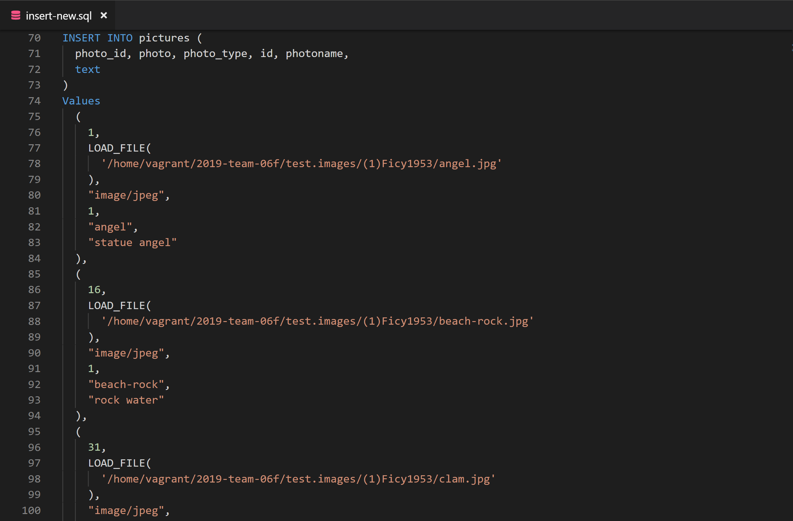

# Sprint 4 Report
## Team True
## Project: Flickr/Instagram Hybrid Internal Photo Search Site
## Site Name: TruHawk
### Roles
1. Project Manager -- Bhumi Patel
2. Developer -- Jason D'Souza
3. Jr Developer -- Hasan Rizwan & Daniel Kolov
4. IT Operations -- Sarina Stoker
5. UI/UX Developer -- Shan Shazad

### Project Goals:

* Create layout diagrams ()
* Incorporate Riemann for capture of application metrics ()
* Responsive web design using CSS media queries in order to fit multiple form factors, such as mobile and tablet ()
* Allow registered users to upload images using hashtags ()
* Functioning "Search-box" for registered users to search images using (hashtags) ()
* Data Encryption at Rest using XtraDB and InnoDB ()
* Functioning upload feature to link pictures that belong to each user ()

### Project Accomplishments: Goals Accomplished ()

* 

### Project Requirements:
1. Language and Framework of Choice:

  * HTML-5 and CSS are rendered using PHP
  * Javascript / jQuery is used for the photo slideshow on the gallery page
  * PHP is used for login and registering processes
  * Vagrant/Packer are used for building and automating the building of the servers
  * Apache 2.4.18 (Ubuntu) web server hosts HTML, PHP, Javascript, and CSS
  * Redis 5.0.3 is used as in-memory data structure store and allow for faster searching and to cache data from the webserver
  * MariaDB Server 10.0.38 provides an SQL interface for accessing data
  
2. Operating System Platform:

    a. Linux - Ubuntu 16.04.5

    b. Process of secrets management: gitignore, openSSL, SSH key

      * Gitignore - The gitignore file was created for the purpose of preventing files from being uploaded without needing to explicitly exclude them. Any file added to gitignore is not included in git commits. Using gitignore allows system-specific files to be untouched, and it ensures that those sensitive files will never get uploaded.

      * OpenSSL - Purpose of using openSSL is to keep the sending and receiving traffic safe and secure between the server and clients without the possibility of the messages being intercepted by outside parties.

      *  SSH Key - To automate secure access to the servers, bypassing the need to manually enter log-in credentials. The SSH key provides strong, encrypted verification and communication between the user and a remote computer. RSA keys are used to verify users before allowing the cloning of our private repository into the remote servers.

      * SHA1-hash - We used SHA-1 with salt to hash our passwords

      

      * Privileges - Unregistered users cannot view photos; Admins have the ability to view and create new users

    c. Capture of application metrics: 

      * We used Prometheus as a tool to capture application metrics. Prometheus is an open-source monitoring system that collects metrics from "our services (need to put appropriate word)" and stores in a time-series database. Prometheus provides a basic web interface for monitoring the status os itself and its exporters, executing queries, and generating graphs.

      * In order to integrate wih complex data from Prometheus, we have used a tool called Grafana which is an open-source for data visualization and monitoring system that collects metrics from our services. Grafana has a features that allows to create alerts, notifications, and ad-hoc filters for our data which will be our future goal.

      * To expand Prometheus beyond metrics about itseif only, we have installed an additional exporter called Node Exporter. Node Exporter provides detailed inforamtion about the system, including CPU, disk, and memory usage.

  
3. Use of Data Store:
  * We are using 2 database servers (Platform: MariaDB/MySQL)
  * One of the database servers serves as the master which we write to. One of the uses of this database is that it is the one that is manipulated by our application. All writes are done to this database. This means that all user information and photos are written to this database.
  * The other database server serves as the slave and is the database which we read from. User information and photos are transferred from the master database to this database using a replication process. Our application uses this database to pull the information and photos.
  * One Redis Cache Server is used for caching the data, which is sent between the slave database and webserver. Redis is a NoSQL key-value data store. For storing a value, we associate it with a key and store it in Redis. The purpose of using Redis caching is to improve the database loading performance.

4. Data Encryption at Rest:

  * Encrypted using a symmetric cipher provided by OpenSSL. Password fields are encrypted using SHA1-hash with salt (salt concatenates random data with the hash)
  * MariaDB 10.0.38 has Data at Rest Encryption and is fully supported for XtraDB and InnoDB. 
  
  * XtraDB: A storage engine for the MariaDB 
  
  * InnoDB: A storage engine for the database management system MySQL. 
  
  * MariaDB allow our files to encrypt:
     - All tablespaces
     - Individual tables
     - Uses a 32-bit integer as a key identifier.
     - Encryption keys can also be rotated, which basically creates a new version of the encryption key. Decryption is also readable through Maria’s file server keys. 

5. Use of MySQL/MariaDB Database Master-Slave Replication:
  * Database Schema:
  
  * 2-Database Servers running MySQL/MariaDB - 1 server serves as a master server and another serves as a slave. Master and slave servers are connected.
  * The purpose of using the master-slave replication process is to enable data from one MySQL database server (serving as 'the master') to be copied automatically to another MySQL databse server (which serves as 'the slave'). 
  * The master-slave replication is a one-way replication (from master to slave); the master database is used only for the write operations, while the slave database is only used for read operations.
  
  * During designing or deploying the application, all the write operations (statement/query that changes the state of the database) are executed ONLY on the master server. As to minimize the risk of data conflicts on the slave, changes can only be made through the replication process. 
  * 1 Apache web server hosts HTML, PHP, JavaScript and CSS
  * 1 Redis Cache server

  
Our setup uses the Apache server for providing the UI (our website) to the end user; information from the registration page and users uploading photos are written to the master database server. The master is connected to a slave server, which holds a copy of the database used for reads. Writes and reads are separated to minimize the required movement of the disk head. On the master database, separating write from read frees up resources to focus on writes only and minimize the movement of the head by writing a few queries in a sequence and only moving the head once every few writes, in order to move the data into the “heap” (permanent storage in the database). On the slave database, reducing its functions to primarily reads allows it to handle more queries by freeing resources for the job.

  
A Redis Cache server is placed between our Web server and Slave Database server and is responsible for storing a portion of the database entries and allows for faster searching and queries entered on the web server.)

 
6. Responsive Design (In-progress):

 Responsive Web Design is in progress. The overall goal is to make the website scale and adapt to multiple form factors and screen sizes, such as when using a smartphone or tablet.  

7. Use of HTTPS:

  
The entire website has left HTTP behind and switched to HTTPS. The “S” in HTTPS stands for “Secure”. It’s the secure version of the standard “hypertext transfer protocol” your web browser uses when communicating with websites. It is important for our application to run on HTTPS to gain the trust of our users. We have generated a self-signed certificate. The certificate is issued by Team True at the Illinois Institute of Technology and is good for one year.

    
  

  

  
  * Firewall
    - Using UFW (Uncomplicated Firewall) in Apache 2:
    - Ideally, we want to limit the number of ports open and only want to use which we need. This is a list of open ports and our current firewall setup.
   
   

  * Authentication keys (if applicable) 
  * Seeding of username and passwords as well as pre-seeding databases with schema and records is done on build using packer build scripts. 
  
8. Use of User Authentication:

  **Unauthenticated users access:** 

  * Have access to “read-only” data
  * Restricted features until account created (cannot view gallery or have any access to photos without an account)
  **Authenticated normal users have access to:**
  * Upload photos
  * View own photos
  * Search for photos (hashtags)
    
  **Administrator Access:**
  * Custom made admin panel
  * Able to create accounts (admin or user)
  * Able to view all accounts
  
  
  
  

9. Creation of Dev Environment:

  
 We have created the webserver, database master and slave, as well as the cache server using Packer. All of our servers are currently deployable. 

  

  

  We are able to deploy all 4 servers using Packer build. Any issues or bugs during deployment or issues with UI/UX are reported using Github Issues. These Github Issues are then furthur assigned as tasks to the appropriate team members to fix. 

10. Layout Design:
  * Home page:
  
  

  * Button Link:
  
  

  * Login & Register page:
  
  

  * Photo-Gallery page:
  
  

  * User Panel:

  

  * Upload Photo:

  

  * Admin Panel:

  

  * Create User:

  

  * View User:

  

  * Site Flow:
  
  
  

11. Management of Visio Diagram:
  
Diagrams are managed on a weekly basis, with continual updates by the UI/UX leader and Project Manager. Two tools that we are using to create diagrams is LucidChart and Draw.io.

  
  

12. Management of project progress:

  
 All the communication and update processes for this project are done through Slack. We have integrated Github on Slack so that commits are shown immediately in order to update the team on any changes made. We are keeping track of our to-do, in-progress and done tasks through Trello. Upon the completion of a task, the person assigned to that task moves the card to the done section. We are keeping in contact throughout the duration of the sprint via Slack to update each other on accomplishments/issues.

  * Trello:
  
  

  * Slack:

  

  * Github Issues:

  
  
  * Github:
  
    
  
13. Test Users:
  
Fifteen test users were generated, and the data is being inserted into our MariaDB databases at build. New users can be added or deleted from the database thereafter. For said purpose, ‘.sql’ files are being used with the insert command to add values into the username, user_type, email and password fields. Fifteen images are being inserted for each user.  

  
  

**Any issues/Bugs?**
  
We  had an issue where mariadb was not granting permissions to the user "worker" and it turned out, after countless hours of hair pulling, that it was missing '' surrounding the IP address.

  

  
We looked into incorporating Cloudinary into our website but found that it is used by our competitor. They have some great tagging and searching features for images. However, incorporating the Cloudinary API into our application leaves our website useless if their servers go down. As a group, we decided to continue developing features for our own application, as opposed to using an API.

**Goals for Next Sprint:**
  * Responsive design, making the website function properly and scale to multiple form factors:mobile & tablet.
    - Include mobile first css which will detect screen size and style our webpage according to device it's being used on.
    - Add JQueries that will assure a great user experience on any screen size.
  * Data Encryption at Rest using XtraDB and InnoDB
  * Allow registered users to upload photos using hashtags
  * Assign new team roles for the sprint
  * Capture of application metrics using Riemann 0.3.1
  * Continue on coding the upload feature to link pictures that belong to each user
  * Functioning search box that will allow registered users to search for images using hashtags.

#### Individual Reflections
**Daniel** - 

**Sarina** - 

**Jason** - 

**Shan** - 

**Hasan** -      

**Bhumi** - 