# Sprint-4 Report
## Team True
## Project: Flickr/Instagram Hybrid Internal Photo Search Site
## Site Name: TruHawk

### Roles:

1. Project Manager -- Bhumi Patel
2. Developer -- Jason D'Souza
3. Jr Developer -- Hasan Rizwan & Daniel Kolov
4. IT Operations -- Sarina Stoker
5. UI/UX Developer -- Shan Shazad

### Project Goals:

* Create layout diagrams (C)
* Move and improve build instructions on GitHub ReadMe.md file (C)
* Incorporate Prometheus for the capture of application metrics (C)
* Upload pictures linked to each user account (C)
* Add a vertical scroll bar table into the Admin Page to view all the users (C)
* Allow registered users to upload images using hashtags (C)
* Make "Search-box" for registered users to search for images using hashtags (C)
* Responsive web design using CSS media queries in order to fit multiple form factors, such as mobile and tablet (I)
* Data Encryption at Rest using XtraDB and InnoDB (I)

### Project Accomplishments: Goals Accomplished (7/9):

* Create layout diagrams
* Moved and added the build instructions on a GitHub Readme.md file
* Incorporated Prometheus for the capture of application metrics
* Uploaded pictures linked to each user account
* Added a vertical scroll var table into the Admin Page to view all the users 
* Allow registered users to upload images using hashtags
* Functioning "Search-box" for registered users to search for images using hashtags

### Project Requirements:
1. Language and Framework of Choice:

  * HTML-5 and CSS are delivered by PHP Version 7.3
  * Javascript is used for the photo slideshow on the gallery page
  * Vagrant/Packer is used for building and automating the building of the servers
  * Apache 2.4.18 (Ubuntu) webserver hosts HTML, PHP, Javascript, and CSS
  * Redis 5.0.3 is used as in-memory data structure store and allows for faster searching and to cache data from the web server
  * MariaDB Server 10.0.38 provides an SQL interface for accessing data
  
2. Operating System Platform:

    a. Linux - Ubuntu 16.04.5

    b. Process of secrets management: gitignore, openSSL, SSH key, HashiCorp Vault

      * Gitignore - The gitignore file was created for the purpose of preventing files from being uploaded without needing to explicitly exclude them. Any file added to gitignore is not included in git commits. Using gitignore allows system-specific files to be untouched, and it ensures that those sensitive files will never get uploaded.

       

      * OpenSSL - Purpose of using openSSL is to keep the sending and receiving traffic safe and secure between the server and clients without the possibility of the messages being intercepted by outside parties.

      *  SSH Key - To automate secure access to the servers, bypassing the need to manually enter log-in credentials. The SSH key provides strong, encrypted verification and communication between the user and a remote computer. RSA keys are used to verify users before allowing the cloning of our private repository into the remote servers.

      * SHA1-hash - We used SHA-1 with salt to hash our passwords

      

      * Privileges - Unregistered users cannot view photos; Admins have the ability to view and create new users

      * HashiCorp Vault - Vault by HashiCorp is a tool for securely managing secrets. A secret is anything that you want to tightly control access to, such as API keys, passwords, or certificates. Vault provides a unified interface to any secret, while providing tight access control and recording a detailed audit log. We plan to incorporate HashiCorp Vault to secure SQL databases and RSA Keys in the next sprint. 

      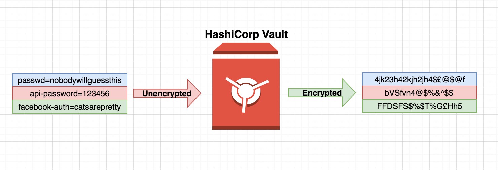      

    c. Capture of application metrics: 

      * We used Prometheus as a tool to capture application metrics. Prometheus is an open-source monitoring system that collects metrics from our services and stores in a time-series database. Prometheus provides a basic web interface for monitoring the status os itself and its exporters, executing queries, and generating graphs.

      * In order to integrate with complex data from Prometheus, we have used a tool called Grafana which is completely an open-source tool for data visualization and a monitoring system that collects metrics from our services. Grafana has feature rich metrics dashboard and graph editor for Prometheus and it also allows to query, create alerts, notifications, and ad-hoc filters for our service which we might incorporate in the future sprint.

      * To expand Prometheus beyond capturing metrics about itself only, we have installed an additional exporter called Node Exporter. Node Exporter is a Prometheus exporter that provides detailed information about the system, including CPU, disk, and memory usage. It will expose webserver's metrics through Prometheus.

      
      
      

  
3. Use of Data Store:
  * We are using 2 database servers (Platform: MariaDB/MySQL)
  * One of the database servers serves as the master which we write to. One of the uses of this database is that it is the one that is manipulated by our application. All writes are done to this database. This means that all user information and photos are written to this database.
  * The other database server serves as the slave and is the database which we read from. User information and photos are transferred from the master database to this database using a replication process. Our application uses this database to pull information and photos.
  * One Redis Cache Server is used for caching the data, which is sent between the slave database and web server. Redis is a NoSQL key-value data store. For storing a value, we associate it with a key and store it in Redis. The purpose of using Redis caching is to improve database loading performance.

4. Data Encryption at Rest:

  * Encrypted using a symmetric cipher provided by OpenSSL. Password fields are encrypted using SHA1-hash with salt (salt concatenates random data with the hash)
  * MariaDB 10.0.38 has Data at Rest Encryption and is fully supported for XtraDB and InnoDB. 
  
  * XtraDB: A storage engine for the MariaDB 
  
  * InnoDB: A storage engine for the database management system MySQL. 
  
  * MariaDB allow our files to encrypt:
     - All tablespaces
     - Individual tables
     - Uses a 32-bit integer as a key identifier.
     - Encryption keys can also be rotated, which basically creates a new version of the encryption key. Decryption is also readable through Maria’s file server keys. 

5. Use of MySQL/MariaDB Database Master-Slave Replication:
  * Database Schema:
  
  * 2-Database Servers running MySQL/MariaDB - 1 server serves as a master server and another serves as a slave. Master and slave servers are connected.
  * The purpose of using the master-slave replication process is to enable data from one MySQL database server (serving as 'the master') to be copied automatically to another MySQL database server (which serves as 'the slave'). 
  * The master-slave replication is a one-way replication (from master to slave); the master database is used only for the write operations, while the slave database is only used for reading operations.
  
  * During designing or deploying the application, all the write operations (statement/query that changes the state of the database) are executed ONLY on the master server. As to minimize the risk of data conflicts on the slave, changes can only be made through the replication process. 
  * 1 Apache web server hosts HTML, PHP, JavaScript and CSS
  * 1 Redis Cache server

  
Our setup uses the Apache server for providing the UI (our website) to the end user; information from the registration page and users uploading photos are written to the master database server. The master is connected to a slave server, which holds a copy of the database used for reads. Writes and reads are separated to minimize the required movement of the disk head. On the master database, separating write from read frees up resources to focus on writes only and minimize the movement of the head by writing a few queries in a sequence and only moving the head once every few writes, in order to move the data into the “heap” (permanent storage in the database). On the slave database, reducing its functions to primarily reads allows it to handle more queries by freeing resources for the job.

  
A Redis Cache server is placed between our Web server and Slave Database server and is responsible for storing a portion of the database entries and allows for faster searching and queries entered on the web server.)

 
6. Responsive Design (In-progress):

<<<<<<< HEAD

=======

 Responsive Web Design is in progress. The overall goal is to make the website scale and adapt to multiple form factors and screen sizes, such as when using a smartphone or tablet. We have added media queries into the css file (style.css) based on expected screen sizes. We have also added styling to reposition, resize and hide elements. There is no framework being specifically utilized for responsive design, as the framework currently being used is Font Awesome, and queries are stored in a css styles page. Will be experimenting and looking into a framework called W3.CSS as this framework has built-in responsiveness, supports responsive mobile-first design by default, equality for all devices and browsers, as well as being simpler and faster.

>>>>>>> 0bf460bc427d5bc4653e34a1c823aa59bd550439

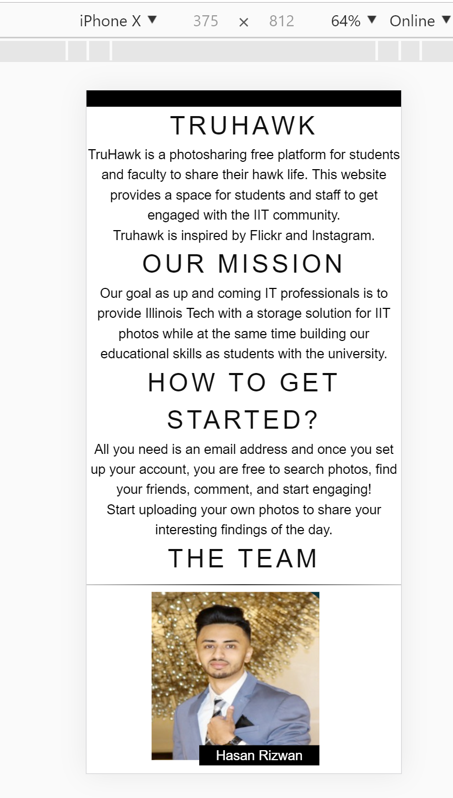

7. Use of HTTPS:

  
The entire website has left HTTP behind and switched to HTTPS. The “S” in HTTPS stands for “Secure”. It’s the secure version of the standard “hypertext transfer protocol” your web browser uses when communicating with websites. It is important for our application to run on HTTPS to gain the trust of our users. We have generated a self-signed certificate. The certificate is issued by Team True at the Illinois Institute of Technology and is good for one year.

    
  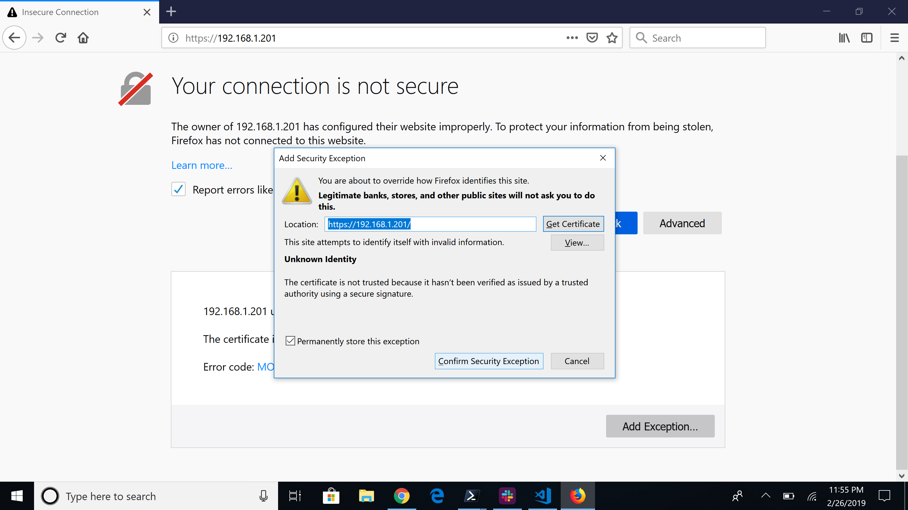

  

  
  * Firewall
    - Using UFW (Uncomplicated Firewall) in Apache 2:
    - Ideally, we want to limit the number of ports open and only want to use which we need. This is a list of open ports and our current firewall setup.
   
   

  * Authentication keys (if applicable) 
  * Seeding of username and passwords as well as pre-seeding databases with schema and records is done on build using packer build scripts. 
  
8. Use of User Authentication:

  **Unauthenticated users access:** 

  * Have access to “read-only” data
  * Restricted features until account created (cannot view gallery or have any access to photos without an account)
  **Authenticated normal users have access to:**
  * Upload photos
  * View own photos
  * Search for photos (hashtags)
    
  **Administrator Access:**
  * Custom made admin panel
  * Able to create accounts (admin or user)
  * Able to view all accounts
  
  
  
  

9. Creation of Dev Environment:

  
 We have created the webserver, database master and slave, as well as the cache server using Packer. All of our servers are currently deployable. 

  

  

  We are able to deploy all 4 servers using Packer build. Any issues or bugs during deployment or issues with UI/UX are reported using Github Issues. These Github Issues are then further assigned as tasks to the appropriate team members to fix. 

10. Layout Design:

  * Font for Site:

  

  * General Home page:
  
  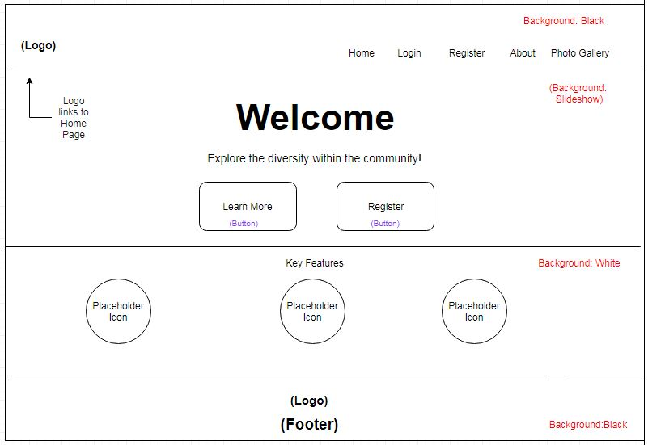

  * Button Link:
  
  

  * Login & Register page:
  
  

  * Photo-Gallery page:
  
  

  * User Home page:
  
  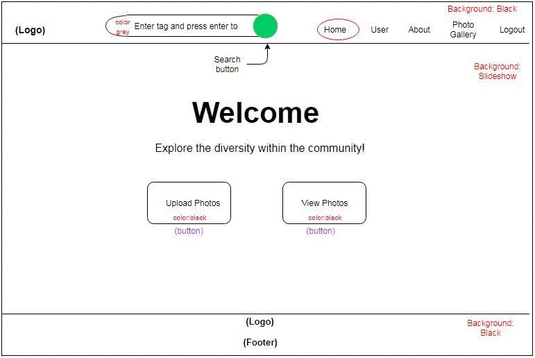
  

  * User Panel:

  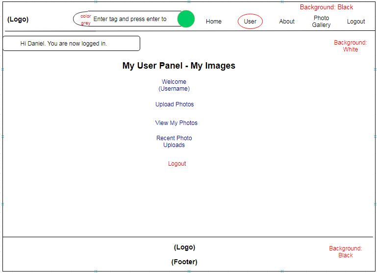

  * Upload Photo:

  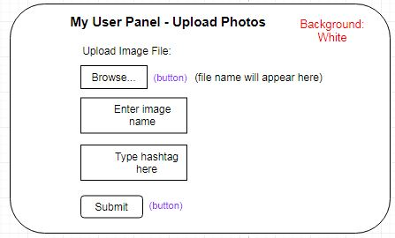

  * Admin Home page:
  
  
  

  * Admin Panel:

  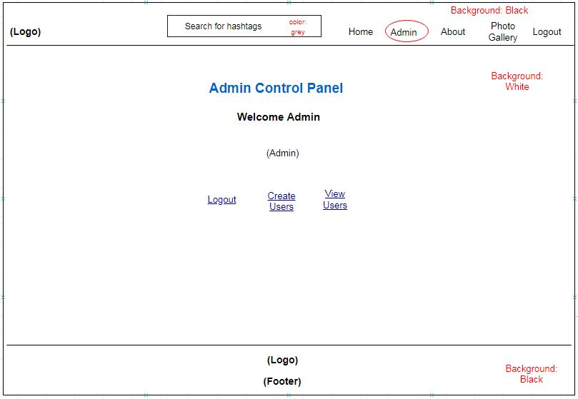

  * Create User:

  

  * View User:

  

  * Site Flow:
  
  
  

11. Management of Visio Diagram:
  
Diagrams are managed on a weekly basis, with continual updates by the UI/UX leader and Project Manager. Two tools that we are using to create diagrams is LucidChart and Draw.io.

  
  

12. Management of project progress:

  
 All the communication and update processes for this project are done through Slack. We have integrated Github on Slack so that commits are shown immediately in order to update the team on any changes made. We are keeping track of our to-do, in-progress and done tasks through Trello. Upon the completion of a task, the person assigned to that task moves the card to the done section. We are keeping in contact throughout the duration of the sprint via Slack to update each other on accomplishments/issues.

  * Trello:
 
  
  
  * Accomplishments
      - Create layout diagrams
        
      - Moved and built the instructions on github
        
      - Incorporated Prometheus for capture of application metrics
        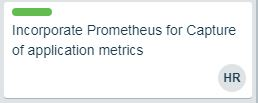
      - Uploaded pictures linked to each user account (C)
        
      - Added a vertical scroll var table into the Admin Page to view all the users 
        
      - Allow registered users to upload images using hashtags
        
      - Functioning "Search-box" for registered users to search images using (hashtags)
        

 
  * Incomplete
    - Responsive Design
      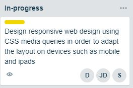
    - Data Encryption at rest
      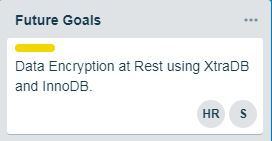

  * Development Environment: Our team members are using Windows and Mac to run Ubuntu via VirtualBox, Visual Studio Code, Sublime Text, Powershell 6, and Git Bash for the developing the environment of the project.

  * Github:
  
  

  * Github Issues:

  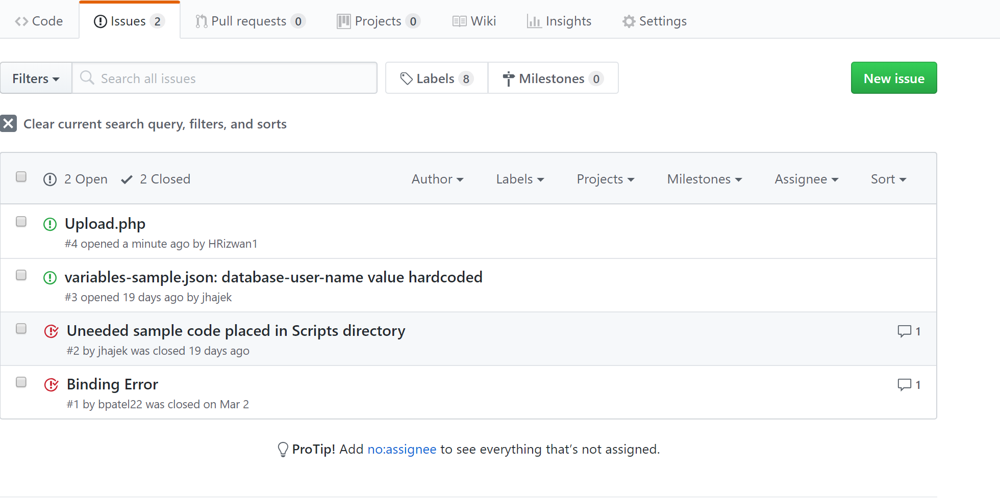
    
  
13. Test Users:
  
Fifteen test users were generated, and the data is being inserted into our MariaDB databases at build. New users can be added or deleted from the database thereafter. For said purpose, ‘.sql’ files are being used with the insert command to add values into the username, user_type, email and password fields. Fifteen images are being inserted for each user.  

  
  
  

**Any issues/Bugs?**
  

**Goals for Next Sprint:**
- Implementing responsive web design using CSS media queries in order to fit multiple form factors, such as mobile and tablet
- Data Encryption at Rest using XtraDB and InnoDB
- Incorporating HashiCorp Vault for data encryption and to secure SQL databases and RSA Keys
 

#### Individual Reflections
**Daniel** - 

**Sarina** - This sprint as IT Operations I did some studying about responsive design and made some css contributions to responsive design by building upon what my teammates Daniel and Jason had started, I helped to manage our trello board by archiving cards and moving tasks around as I appropriate, I updaated our diagrams for site functionality to add new changes noted by professor this sprint (I ended up have to do this twice because I missed some vital features). Also I assisted with the creation of this report. This sprint our team has made some crucial progress and our sight is coming full circle. 

**Jason** - 

**Shan** - I primarily focused on researching more about data encryption at rest using HashiCorp Vault technology. I carefully looked over some tutorials that were on the internet, but I am still having trouble fully understanding the concept behind. Encryption data at rest requires to generate a key management and encryption plugin. This is where it will encrypt data at rest and decrypt as well. MariaDB has three methods to do encryption at rest: 

   * File Key Management Plugin
   * AWS Key Management Plugin
   * eperi Gateway for Databases 

The plugin is there but the key that is used to decrypt is on the server which raises a concern for data security. Even if I were to use AWS key management, the credentials will be viewable since it is on the cloud. The file key management plugin would be where the key is generated through and stored. None of these plugins are that effective to prevent from data being leaked. I even thought of the idea of having the credentials stored on a cloud file storage, but it would be the same thing as having AWS doing our encryption work. 

I could have the keys stored under HashiCorp so that secret management comes into play, but since I have never touch those security tools it will take me some time to learn it. The reason why we don't have encryption at rest today because I wanted to look into some solutions on how to secure the key properly. I'm also learning how HashiCorp works and that will be used on our backend as well for quick automation. 

Besides the research being done on this, I worked with Hasan on testing the Prometheus application metrics. I sent out a DDOS attack using Kali Linux penetrating tools to see if our metrics is working properly. After hitting our main server, we were able to see an increase of our data metrics which we wanted to see. 

**Hasan** -      

**Bhumi** - 
